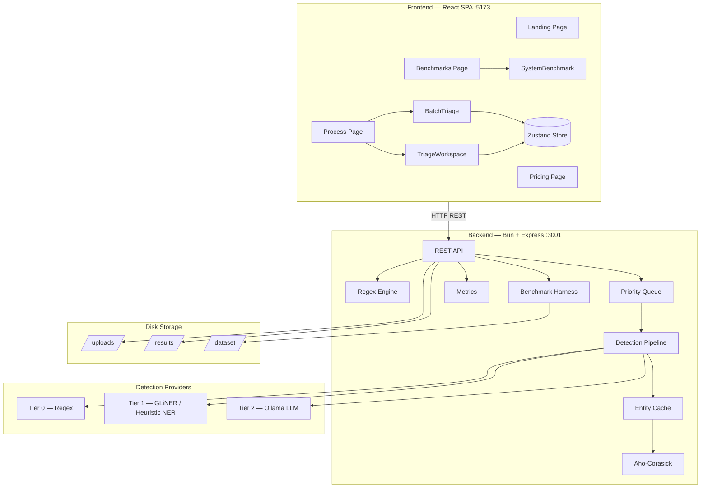
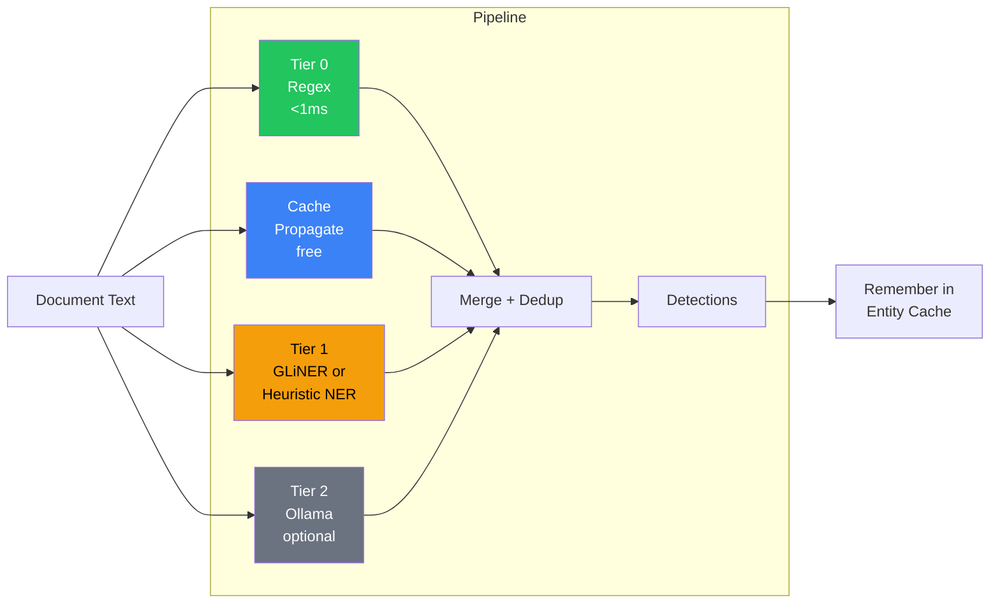
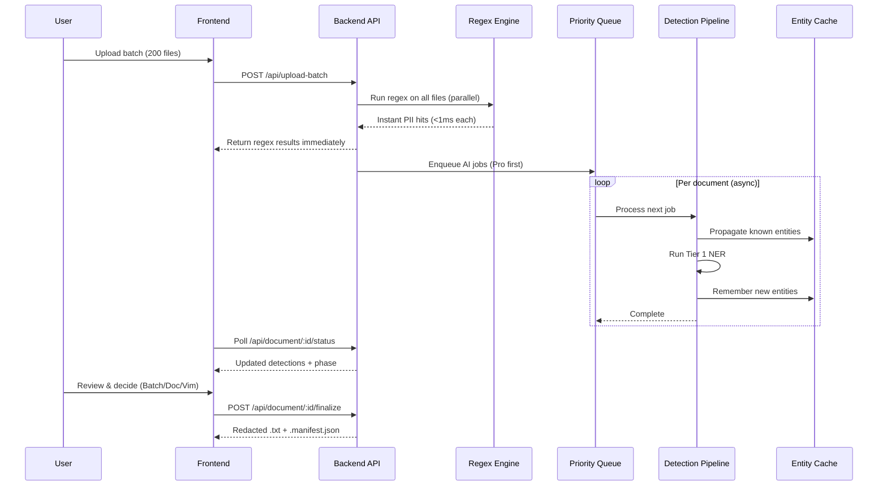
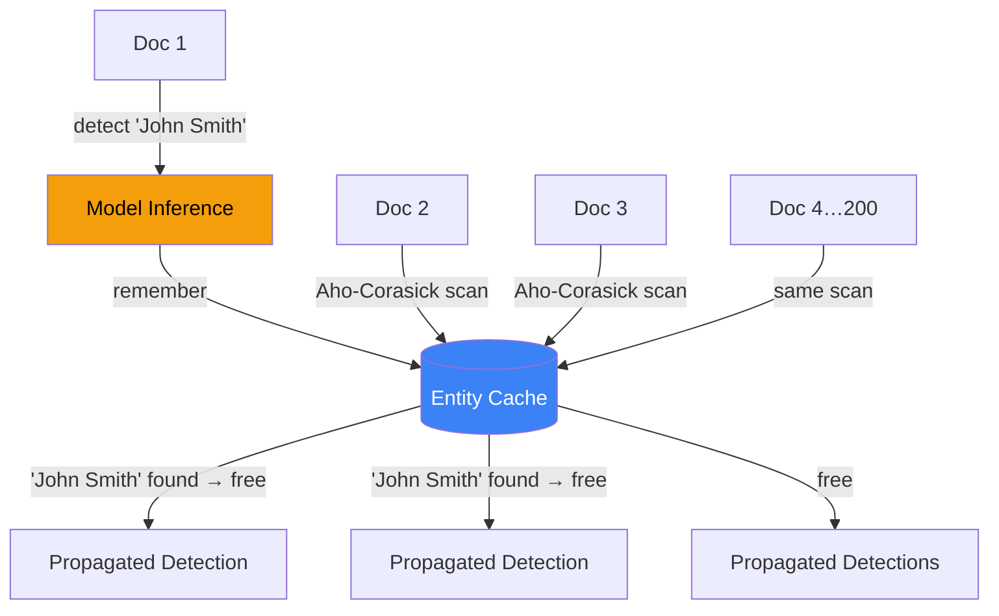
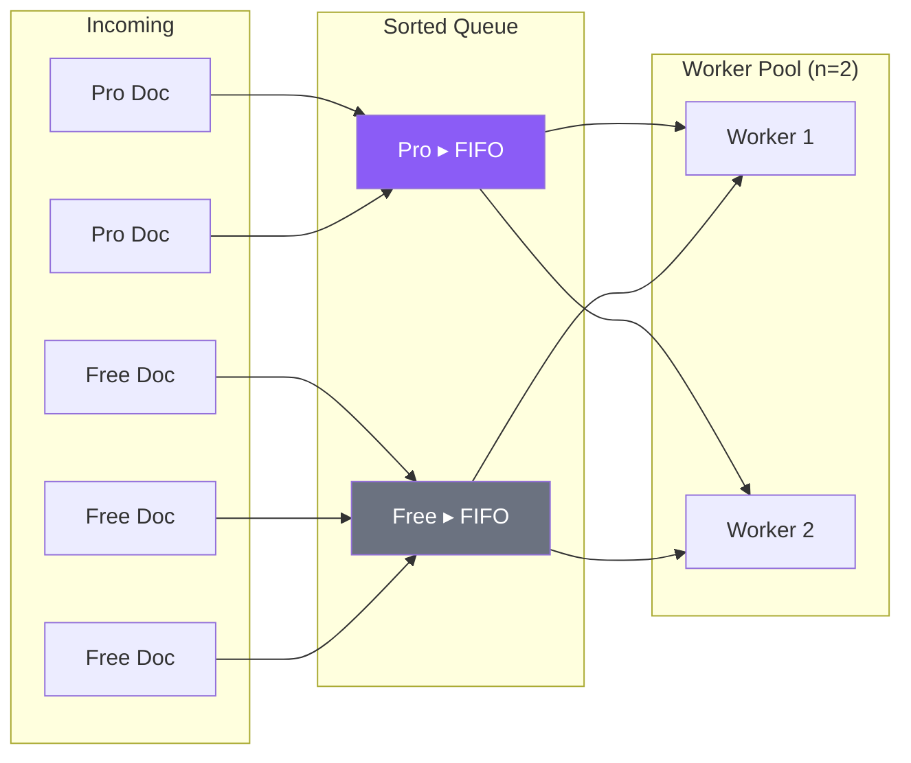
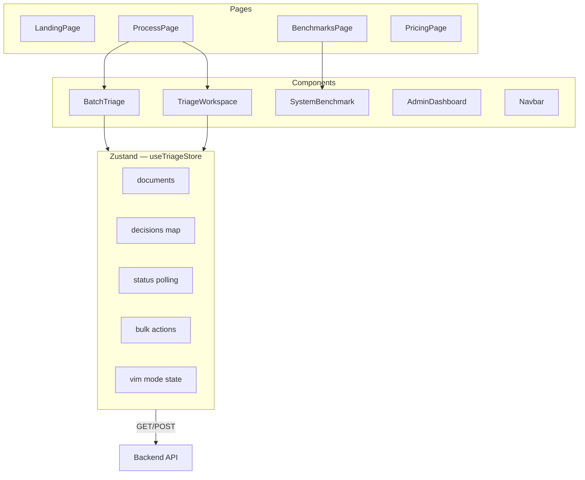

# Architecture — Conseal.ai

## System Overview



---

## Detection Pipeline

The core idea: **detect each unique entity once, apply everywhere.**



**Tier availability is graceful** — if GLiNER model isn't loaded, heuristic NER runs instead. If Ollama is down, Tier 2 is skipped. The pipeline never stalls.

---

## Request Flow — Upload to Export



---

## Entity Cache & Cross-Document Propagation



> **47,251 occurrences → 3,948 unique entities → 12× fewer inferences**

---

## Priority Queue — Pro vs Free



Pro jobs always dequeue before free jobs. Workers process from the front.

---

## Frontend Architecture



### Three Triage Modes

| Mode | Input | UX |
|------|-------|----|
| **Batch** | Mouse/keyboard | Cross-doc sweep — bulk approve by type/confidence |
| **Document** | Mouse | Single file deep review with full text |
| **Vim** | Keyboard only | `j/k` navigate, `y` approve, `x` reject, `a` approve all |

---

## API Endpoints

```
POST   /api/upload-batch        Upload files → regex results + enqueue AI
GET    /api/document/:id        Full document record
GET    /api/document/:id/status Lightweight poll for progressive enrichment
POST   /api/document/:id/finalize Apply decisions → write redacted output
GET    /api/metrics             Live per-tier timing + queue state
GET    /api/benchmark           Run benchmark harness
GET    /api/health              Provider availability
GET    /api/documents           List all processed documents
```

---

## Repo Structure

```
sprintfour/
├── frontend-sprintfour/           # React SPA (Vite + Tailwind)
│   └── src/
│       ├── pages/                 # Landing, Process, Benchmarks, Pricing
│       ├── components/            # BatchTriage, TriageWorkspace, SystemBenchmark
│       └── store/useTriageStore   # Zustand — docs, decisions, polling, vim
│
├── backend-sorintfour/            # Bun + Express API
│   └── src/
│       ├── index.ts               # HTTP endpoints + finalize logic
│       └── services/
│           ├── regexEngine.ts         # Tier 0
│           ├── providers/             # Regex, GLiNER, Heuristic, Ollama
│           ├── detectionPipeline.ts   # Tier composition + merge
│           ├── entityCache.ts         # Content-addressed cache
│           ├── ahoCorasick.ts         # Multi-pattern string matcher
│           ├── priorityQueue.ts       # Pro-first scheduler
│           ├── metrics.ts             # Live timing tracker
│           └── benchmark.ts           # Benchmark harness
│
├── README.md
└── ARCHITECTURE.md
```

---

## Key Design Decisions

| Decision | Why |
|----------|-----|
| **Regex first, AI async** | Instant feedback; AI enriches progressively |
| **Entity cache + Aho-Corasick** | Detect once, propagate free — 12× fewer inferences |
| **Heuristic NER fallback** | System works with zero external models |
| **Pro-first priority queue** | Paid users get measurably faster processing |
| **Decisions not documents** | ~2000 detections collapse to ~15 class decisions |
| **Zustand over Redux** | Minimal boilerplate for a focused state shape |
| **Bun runtime** | Fast startup, native TS, good DX |
